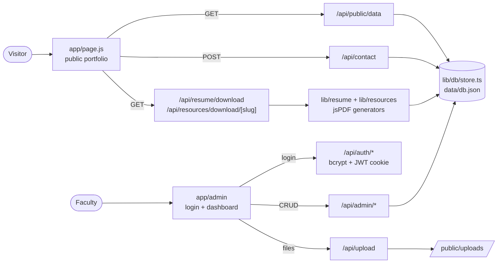

<div align="center">


<br />

<a href="https://jandyboiswebsite.vercel.app"></a>
<a href="https://jandyboiswebsite.vercel.app/admin"></a>
<a href="https://github.com/GlazyKahito/jandyboiswebsite"></a>

<br />


<br /><br />

*“To observe nature closely is to study the grandest manuscript ever written.”*

</div>

<br />

## ❦ Contents

<table>
<tr>
<td valign="top">

**The Work**
- [Overview](#-overview)
- [Features](#-features)
- [Design system](#-design-system)

</td>
<td valign="top">

**The Machinery**
- [Architecture](#-architecture)
- [Tech stack](#-tech-stack)
- [API reference](#-api-reference)

</td>
<td valign="top">

**The Workshop**
- [Getting started](#-getting-started)
- [Environment](#-environment)
- [Deployment](#-deployment)

</td>
</tr>
</table>

---

## 📖 Overview

A portfolio, teaching-resource archive, and academic CV for **Janardhan Aghav** — *Jandy* to his students — Biology Faculty (M.Sc., B.Ed.) at **Shubham Raje Junior College (SRJC), Thane West, Maharashtra**.

It is designed to feel like a vintage laboratory instrument crossed with a naturalist's field notebook: serif display type, monospace readouts, a blueprint grid, and brass-on-black colour. The public pages open like a book; behind them sits a full admin CMS so every record on the site can be edited without touching code.

| | |
| :-- | :-- |
| **Educator** | Janardhan Aghav (“Jandy”) |
| **Role** | Biology Faculty (M.Sc., B.Ed.) |
| **Institution** | Shubham Raje Junior College (SRJC), Patlipada, Thane (West) |
| **Teaches** | Maharashtra State Board HSC Biology · NEET-UG |
| **Specialisms** | Plant Physiology · Human Anatomy & Physiology · Cytogenetics · Laboratory Histology |

---

## ✨ Features

<table>
<tr>
<td width="50%" valign="top">

### 📕 Cinematic book opening
A 3D antique book opens on first visit — dust particles, warm lighting, a botanical engraving reveal, a skip control, and optional ambient audio.

<sub><code>components/animations/BookOpeningIntro.jsx</code></sub>

</td>
<td width="50%" valign="top">

### 🌏 Three languages, live
Switch between **English**, **मराठी**, and **हिंदी** without a reload. The choice is remembered, and every string is editable from the admin.

<sub><code>context/LanguageContext.jsx</code></sub>

</td>
</tr>
<tr>
<td valign="top">

### 📄 Résumé PDF, generated live
An editorial-style academic CV built on request from whatever is currently published in the data store.

<sub><code>GET /api/resume/download</code></sub>

</td>
<td valign="top">

### 🧬 Study folios
Downloadable biology handouts with checkpoints, question sets, and diagram checklists.

<sub><code>GET /api/resources/download/[slug]</code></sub>

</td>
</tr>
<tr>
<td valign="top">

### ✉️ Contact desk
A vintage correspondence form with client and server validation, a honeypot field, and stored enquiries. Email delivery via Resend is optional.

<sub><code>POST /api/contact</code></sub>

</td>
<td valign="top">

### 🗝️ Faculty admin CMS
Manage profile, education, experience, skills, achievements, resources (with file uploads), enquiries, and translations — plus a CV preview.

<sub><code>/admin</code> → <code>/admin/dashboard</code></sub>

</td>
</tr>
</table>

<details>
<summary><b>The eight sections of the public page</b></summary>

<br />

| Section | What it is |
| :-- | :-- |
| **Hero** | An academic-publication frontispiece: credentials, headline metrics, calls to action |
| **About** | An open field notebook holding the teaching philosophy and creed |
| **Education** | A timeline of degrees, with badges marking provisional entries |
| **Experience** | Teaching chronicle at SRJC Thane with core responsibilities |
| **Skills** | Botany, zoology, cytology, genetics, and lab skills — an editorial layout, no arbitrary percentage bars |
| **Achievements** | Milestones, awards, and mentorship cohorts, with demo entries labelled |
| **Teaching Resources** | A searchable catalogue with category tabs and direct downloads |
| **Contact** | The correspondence desk |

</details>

---

## 🎨 Design system

**Vintage instrument panel** — ink black, brass, and parchment, with an amber phosphor accent — finished with [21st.dev](https://21st.dev)-style micro-interactions and [Lenis](https://github.com/darkroomengineering/lenis) smooth scrolling.

### Palette

<div align="center">


</div>

### Typography

| Use | Typeface |
| :-- | :-- |
| Headings | **Fraunces** |
| Body | **IBM Plex Sans** |
| Labels & readouts | **IBM Plex Mono** |
| Marathi & Hindi | **Noto Serif Devanagari** |

### Motion & light

| Effect | How it works |
| :-- | :-- |
| **Smooth scroll** | Lenis drives page scrolling and nav jumps; switched off for visitors who prefer reduced motion |
| **Blueprint grid & film grain** | A fixed CSS grid and procedural SVG noise — texture with no image assets |
| **Corner ticks** | Registration marks on every panel, drawn with CSS gradients (`.ticks`) |
| **`SpotlightCard`** | A highlight that follows the cursor across skill and resource cards |
| **Sliding pill dock** | The active nav pill glides with `layoutId="activeNavPill"` on a spring (`stiffness: 400, damping: 30`) |
| **Scroll-lit quote** | Words in the pull quote light up one by one as it scrolls into view |
| **Scroll bands** | Oversized outlined type that drifts sideways with scroll position |
| **Parallax hero** | The specimen plate and title move at different rates; a live IST clock sits in the readout strip |
| **Scroll progress** | A phosphor hairline across the top of the page |
| **Button shimmer** | A diagonal light sweep on primary actions (`btn-shimmer`) |

---

## 🏗 Architecture



<details>
<summary><b>Project layout</b></summary>

```text
jandyboiswebsite/
├── app/
│   ├── page.js                  # public portfolio
│   ├── layout.js                # fonts, metadata, shell
│   ├── globals.css              # design tokens, grain, shimmer
│   ├── admin/                   # login + dashboard
│   └── api/
│       ├── auth/                # login · logout · me
│       ├── admin/               # profile · education · experience · skills
│       │                        # achievements · resources · enquiries · translations
│       ├── public/data/         # everything the public page renders
│       ├── contact/             # enquiry form
│       ├── upload/              # resource file uploads
│       ├── resume/download/     # live CV PDF
│       └── resources/download/  # study folio PDFs
├── components/
│   ├── animations/              # BookOpeningIntro
│   ├── layout/                  # PortfolioShell, Footer
│   ├── navigation/              # FloatingNav
│   ├── sections/                # Hero, About, Education, Experience,
│   │                            # Skills, Achievements, TeachingResources, Contact
│   └── ui/                      # SpotlightCard
├── context/                     # LanguageContext
├── lib/
│   ├── auth/                    # JWT sessions
│   ├── db/                      # JSON store + seed data
│   ├── resume/                  # CV PDF generator
│   └── resources/               # folio PDF generator
└── data/db.json                 # the data store
```

</details>

---

## 🛠 Tech stack

| Layer | Choice | Why |
| :-- | :-- | :-- |
| Framework | **Next.js 16** (App Router) | Pages and API routes in one deployable unit |
| UI | **React 19**, JavaScript (`.jsx`) | Frontend kept in plain JS by request |
| Server | **TypeScript** (`.ts`) | Typed routes, store, and generators |
| Styling | **Tailwind CSS v4** | Custom dark-academia tokens |
| Motion | **Framer Motion** + **Lenis** | Spring physics, scroll-linked animation, smooth scrolling |
| Icons | **Lucide React** | |
| PDFs | **jsPDF** | CV and folio generation on the server |
| Auth | **bcryptjs** + **jose** | Hashed password, signed JWT in an `httpOnly` cookie (7-day session) |

---

## 🔌 API reference

<details>
<summary><b>Public</b></summary>

| Method | Route | Purpose |
| :-- | :-- | :-- |
| `GET` | `/api/public/data` | All published content for the portfolio |
| `POST` | `/api/contact` | Submit an enquiry |
| `GET` | `/api/resume/download` | Generate the CV as a PDF |
| `GET` | `/api/resources/download/[slug]` | Download a study folio |

</details>

<details>
<summary><b>Auth</b></summary>

| Method | Route | Purpose |
| :-- | :-- | :-- |
| `POST` | `/api/auth/login` | Sign in, set the session cookie |
| `POST` | `/api/auth/logout` | Clear the session cookie |
| `GET` | `/api/auth/me` | Current session |

</details>

<details>
<summary><b>Admin</b> — session required</summary>

| Route | Methods |
| :-- | :-- |
| `/api/admin/profile` | `GET` `PUT` |
| `/api/admin/education` | `GET` `POST` `PUT` `DELETE` |
| `/api/admin/experience` | `GET` `POST` `PUT` `DELETE` |
| `/api/admin/skills` | `GET` `POST` `PUT` `DELETE` |
| `/api/admin/achievements` | `GET` `POST` `PUT` `DELETE` |
| `/api/admin/resources` | `GET` `POST` `PUT` `DELETE` |
| `/api/admin/enquiries` | `GET` `PUT` `DELETE` |
| `/api/admin/translations` | `GET` `PUT` |
| `/api/upload` | `POST` |

</details>

---

## 🚀 Getting started

```bash
git clone https://github.com/GlazyKahito/jandyboiswebsite.git
cd jandyboiswebsite
npm install
cp .env.example .env.local   # optional — sensible defaults are built in
npm run dev
```

| | |
| :-- | :-- |
| Public site | <http://localhost:3000> |
| Faculty admin | <http://localhost:3000/admin> |

### Default admin sign-in

| Field | Value |
| :-- | :-- |
| Email | `admin@jandy.edu` |
| Passkey | `JandyBio2026!` |

> [!WARNING]
> These defaults are public — they are printed here and in `.env.example`. Set your own `ADMIN_EMAIL`, `ADMIN_PASSWORD`, and `JWT_SECRET` before any real deployment.

---

## ⚙️ Environment

| Variable | Required | What it does |
| :-- | :-: | :-- |
| `ADMIN_EMAIL` | — | Admin login email. Defaults to `admin@jandy.edu` |
| `ADMIN_PASSWORD` | — | Admin passkey, used when the data store is first seeded |
| `JWT_SECRET` | — | Signs session tokens. **Set this in production** |
| `RESEND_API_KEY` | — | Enables email dispatch for contact enquiries |
| `NEXT_PUBLIC_APP_URL` | — | Canonical site URL |

---

## 🚢 Deployment

Deployed on **Vercel** at [jandyboiswebsite.vercel.app](https://jandyboiswebsite.vercel.app). Push to `master` to ship.

> [!NOTE]
> Content lives in `data/db.json` and uploads in `public/uploads/`. Vercel's filesystem is read-only at runtime, so admin edits and uploads made on the live site won't persist the way they do locally. `.env.example` reserves `DATABASE_URL` (Postgres — Neon / Supabase) and `BLOB_READ_WRITE_TOKEN` (Vercel Blob) for this, but neither is wired into the code yet.

---

## 📜 Academic integrity

The affiliation with Shubham Raje Junior College (SRJC), Thane West, the M.Sc. and B.Ed. qualifications, and the pull quote come from the college's [faculty page](https://shubhamrajecollege.com/8697_faculty.html). Sample records — degrees, awards, experience details — are **provisional demo content**, labelled as such on the site, and fully editable by Professor Aghav through the faculty admin.

<div align="center">

<br />

<sub>Built with walnut, bronze, and a great deal of parchment.</sub>


</div>
